# Jarkom-Modul-1-2025-K-05

|No|Nama anggota|NRP|
|---|---|---|
|1. | Adiwidya Budi Pratama | 5027241012|
|2. | Ni'mah Fauziyyah Atok | 5027241103|
---
## Soal 1
> Untuk mempersiapkan pembuatan entitas selain mereka, Eru yang berperan sebagai Router membuat dua Switch/Gateway. Dimana Switch 1 akan menuju ke dua Ainur yaitu Melkor dan Manwe. Sedangkan Switch 2 akan menuju ke dua Ainur lainnya yaitu Varda dan Ulmo. Keempat Ainur tersebut diberi perintah oleh Eru untuk menjadi Client.


---
## Soal 2
> Karena menurut Eru pada saat itu Arda (Bumi) masih terisolasi dengan dunia luar, maka buat agar Eru dapat tersambung ke internet.


---
## Soal 3 - 4
> Sekarang pastikan agar setiap Ainur (Client) dapat terhubung satu sama lain.
> Setelah berhasil terhubung, sekarang Eru ingin agar setiap Ainur (Client) dapat mandiri. Oleh karena itu pastikan agar setiap Client dapat tersambung ke internet.


---
## Soal 5
> Ainur terkuat Melkor tetap berusaha untuk menanamkan kejahatan ke dalam Arda (Bumi). Sebelum terjadi kerusakan, Eru dan para Ainur lainnya meminta agar semua konfigurasi tidak hilang saat semua node di restart.


write this on `/root/.bashrc`

---
## Soal 6
> Setelah semua Ainur terhubung ke internet, Melkor mencoba menyusup ke dalam komunikasi antara Manwe dan Eru. Jalankan file berikut (link file) lalu lakukan packet sniffing menggunakan Wireshark pada koneksi antara Manwe dan Eru, lalu terapkan display filter untuk menampilkan semua paket yang berasal dari atau menuju ke IP Address Manwe. Simpan hasil capture tersebut sebagai bukti.

- in client Manwe
```c
wget --no-check-certificate "https://drive.google.com/uc?export=download&id=1bE3kF1Nclw0VyKq4bL2VtOOt53IC7lG5" -O traffic.zip

unzip traffic.zip

chmod +x traffic.zip
```
- go to wireshark
start capture > manwe -> eru 
```
./traffic.sh
```
- stop capture


---
## Soal 7
> Untuk meningkatkan keamanan, Eru memutuskan untuk membuat sebuah FTP Server di node miliknya. Lakukan konfigurasi FTP Server pada node Eru. Buat dua user baru: ainur dengan hak akses write&read dan melkor tanpa hak akses sama sekali ke direktori shared. Buktikan hasil tersebut dengan membuat file teks sederhana kemudian akses file tersebut menggunakan kedua user.

- in Eru
```c
apt install -y vsftpd
mkdir -p shared
adduser melkor
adduser ainur

apt install -y inetutils-ftp
```
- config di nano /etc/vsftpd.conf
```c
listen=YES
listen_ipv6=NO
anonymous_enable=NO
local_enable=YES
write_enable=YES
chroot_local_user=YES
allow_writeable_chroot=YES
userlist_enable=YES
userlist_file=/etc/vsftpd.user_list
userlist_deny=YES

// tambahin di akhir
chroot_local_user=YES
allow_writeable_chroot=YES
```
```
ls
service vsftpd start

ftp localhost
input : ainur:ainur
```
```
*Eru
chown ainur:ainur shared/
chmod 700 shared/
cd shared/
```
```
su ainur
touch punyainur.txt
> su melkor
touch coba.txt (denied)
```


---
## Soal 8
> Ulmo, sebagai penjaga perairan, perlu mengirimkan data ramalan cuaca ke node Eru. Lakukan koneksi sebagai client dari node Ulmo ke FTP Server Eru menggunakan user ainur. Upload sebuah file berikut (link file). Analisis proses ini menggunakan Wireshark dan identifikasi perintah FTP yang digunakan untuk proses upload.

- node ulmo
```c
wget --no-check-certificate "https://docs.google.com/uc?export=download&id=11ra_yTV_adsPIXeIPMSt0vrxCBZu0r33" -O cuaca.zip
apt update && apt install -y unzip
unzip cuaca.zip
```
- in Eru
```c
service vsftpd start
```
*pastikan  config : local_enable=YES
lalu restart service 

- node Ulmo
```c
ftp 10.66.1.1
login as ainur:ainur
put cuaca.txt
put mendung.jpg
quit
```


---
## Soal 9
> Eru ingin membagikan "Kitab Penciptaan" di (link file) kepada Manwe. Dari FTP Server Eru, download file tersebut ke node Manwe. Karena Eru merasa Kitab tersebut sangat penting maka ia mengubah akses user ainur menjadi read-only. Gunakan Wireshark untuk memonitor koneksi, identifikasi perintah FTP yang digunakan, dan uji akses user ainur.

- node Eru
```c
wget --no-check-certificate "https://docs.google.com/uc?export=download&id=11ua2KgBu3MnHEIjhBnzqqv2RMEiJsILY" -O kitab_penciptaan.zip
unzip kitab_penciptaan.zip > /srv/ftp/shared
```
- edit nano /etc/vsftpd.conf
tambahkan "user_config_dir=/etc/vsftpd_user_conf"

- config ftp buat user agar setiap kali ainur login → dia langsung masuk ke /srv/ftp/shared
```
mkdir -p /etc/vsftpd_user_conf
nano /etc/vsftpd_user_conf/ainur
Isi : 
local_root=/srv/ftp/shared
write_enable=NO
download_enable=YES
```
- service vsftpd restart

- Buka node Manwe
```c
ftp 10.66.1.1 > login ainur
switch to binary untuk transfer file
get kitab_penciptaan.txt (berhasil)
put kitab_penciptaan.txt (permission denied)
quit
```


---
## Soal 10
> Melkor yang marah karena tidak diberi akses, mencoba melakukan serangan dengan mengirimkan banyak sekali request ke server Eru. Gunakan command ping dari node Melkor ke node Eru dengan jumlah paket yang tidak biasa (spam ping misalnya 100 paket). Amati hasilnya, apakah ada packet loss? Catat average round trip time untuk melihat apakah serangan tersebut mempengaruhi kinerja Eru.
- on Wireshark start capture Melkor -> Eru
- node Melkor
```c
ping 10.66.1.1 -c 100
```
- Analyze if theres a packet loss


---
## Soal 11
> Sebelum era koneksi aman, Eru sering menyelinap masuk ke wilayah Melkor. Eru perlu masuk ke node tersebut untuk memeriksa konfigurasi, namun ia tahu Melkor mungkin sedang memantau jaringan. Buktikan kelemahan protokol Telnet dengan membuat akun dan password baru di node Melkor kemudian menangkap sesi login Eru ke node Melkor menggunakan Wireshark. Tunjukkan bagaimana username dan password dapat terlihat sebagai plain text.
> node Melkor
- installation
```
apt update && apt install openbsd-inetd telnetd -y
```
- confg inet
```nano /etc/inetd.conf
nyalakan standard service telnet
""telnet  stream  tcp     nowait  root    /usr/sbin/tcpd  /usr/sbin/telnetd""
```
```
service openbsd-inetd start
adduser ninimm:ninim
```
- node Eru
```
telnet 10.66.1.2 [Prefix]
login as ninim:ninim
```
- Analyze on wirehshark
- filter `telnet`
- look for `info : Telnet Data..[Malformed Packet]`


---
## Soal 12
> Eru mencurigai Melkor menjalankan beberapa layanan terlarang di node-nya. Lakukan pemindaian port sederhana dari node Eru ke node Melkor menggunakan Netcat (nc) untuk memeriksa port 21, 80, dalam keadaan terbuka dan port rahasia 666 dalam keadaan tertutup.

- in Eru
```
apt update && apt install netcat
```
- in node Melkor
```c
apt install -y iptables

nc -l 21 >/dev/null 2>&1 &
nc -l 80 >/dev/null 2>&1 &
iptables -I INPUT -p tcp --dport 666 -j REJECT
```
- node Eru
nc -zv 10.66.1.2 21 80 666


---
## Soal 13
> Setelah insiden penyadapan Telnet, Eru memerintahkan semua koneksi administratif harus menggunakan SSH (Secure Shell) untuk mengamankan jaringan. Lakukan koneksi SSH dari node Varda ke Eru. Tangkap sesi tersebut menggunakan Wireshark. Analisis dan jelaskan mengapa username dan password tidak dapat dilihat seperti pada sesi Telnet. Tunjukkan paket-paket terenkripsi dalam hasil capture sebagai bukti keamanan SSH.

- in Eru
```c
apt update && apt install -y openssh-server
service ssh start
```
```
adduser <test>
psswd <test>
```
- start capture on wireshark

- Node Varda
```c
apt install -y openssh-server
ssh <test>@10.66.1.1
```
- stop capture on wireshark


---
## Soal 14
```c
nc 10.15.43.32 3401
```
#### Pertanyaan A
How many packets are recorded in the pcapng file?
Format: int
##### Penyelesaian
Di bagian bawah Wireshark,ditampilkan berapa banyak paket yang ada di file PCAP tersebut.
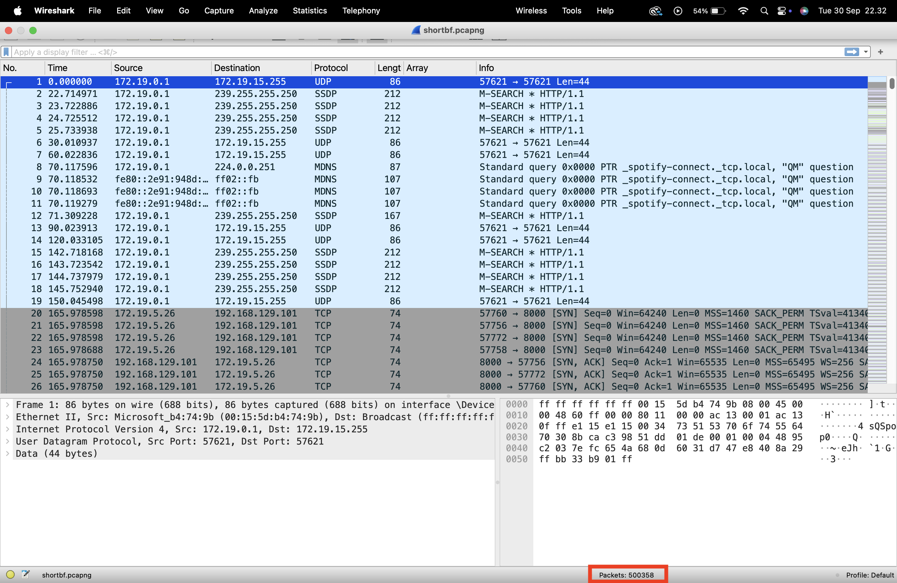
#### Jawaban
```c
500358
```
- Teori
Wireshark menghitung jumlah paket total dan menampilkannya di bilah status/bagian bawah aplikasinya.
#### Pertanyaan B
What are the user that successfully logged in?
Format: user:pass
##### Penyelesaian 1
Gunakan display filter berikut di Wireshark untuk memfilter paket yang mengandung kata "success"
```c
frame contains "success"
```
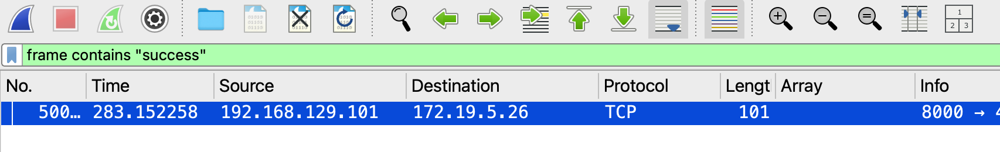
- Teori
Display filter (```frame contains "..."```) mencari teks dalam isi paket; berguna untuk menemukan kata-kata yang muncul di payload (mis. "success", "login", dsb.).
##### Penyelesaian 2
Buka paket tersebut, lalu gunakan menu Follow > TCP Stream untuk melihat isi aliran TCP tersebut secara utuh (berisi data yang dikirim/diterima pada stream itu).
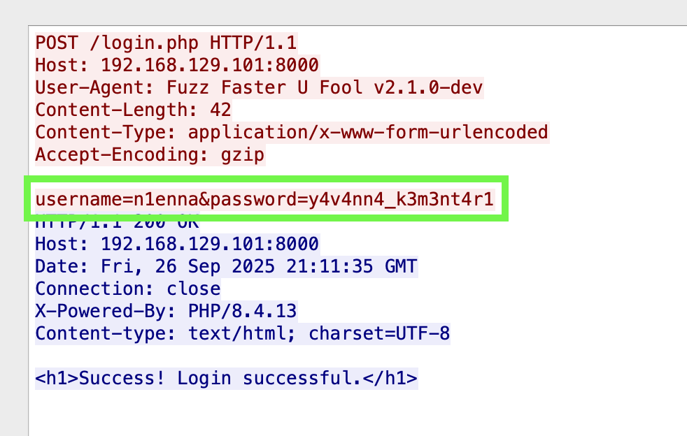
#### Jawaban
```c
n1enna:y4v4nn4_k3m3nt4r1
```
#### Pertanyaan C
In which stream were the credentials found?
Format: int
##### Penyelesaian 1
Lihat di bagian "Filter" setelah membuka Follow TCP Stream; akan terlihat sesuatu seperti tcp.stream eq [nomor_stream]. Nomor itu menunjukkan ID stream tempat kredensial ditemukan.
#### Jawaban
```c
41824
```
- Teori
Wireshark memberi setiap koneksi TCP yang ter-capture sebuah indeks tcp.stream (0,1,2,...). Ini memudahkan referensi ke seluruh percakapan TCP tertentu. Saat mengikuti TCP stream, filter otomatis (tcp.stream eq N) menunjukkan bahwa paket-paket yang dilihat adalah bagian dari stream bernomor N — jadi mencari nomor stream memberitahu "di aliran mana" informasi itu lewat.
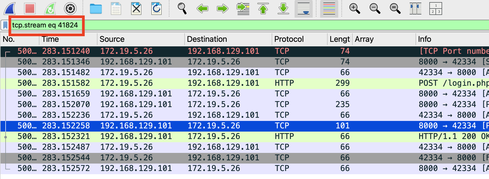

#### Pertanyaan D
What tools are used for brute force?
Format: Hydra v1.8.0-dev
##### Penyelesaian 1
Dari "Follow -> TCP Stream" yang sama, dapat mengenali tanda/teks yang menunjukkan tools yang digunakan untuk brute force; dari situ terlihat nama tool yang digunakan.
#### Jawaban
```c
Fuzz Faster U Fool v2.1.0-dev
```
- Teori
Banyak tools otomatis (seperti brute-forcers atau fuzzers) meninggalkan jejak teks atau pola tertentu di payload (mis. string user-agent, banner, atau output tool). Dengan melihat keseluruhan aliran TCP, kamu sering dapat mengenali nama tool atau signature-nya. Contohnya, tool fuzzing/ brute-force sering mengirim pola uji berulang yang mudah terlihat, atau menyertakan baris informasi versi/identitas yang bisa dibaca.
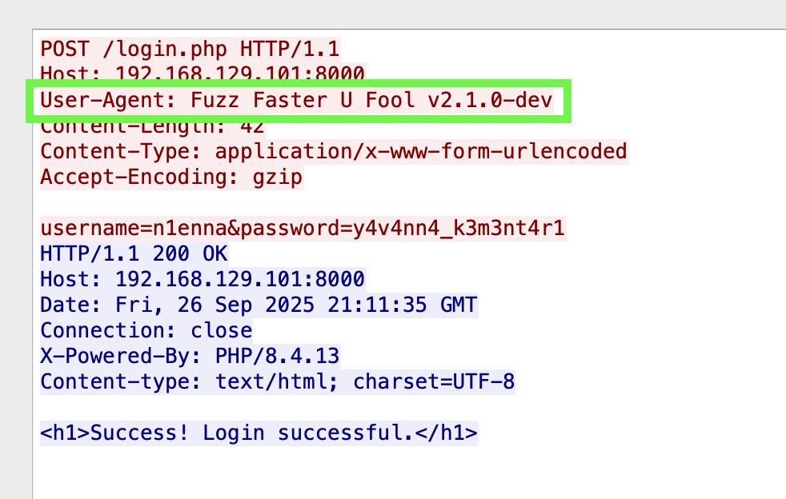

### Flag
Jika semua pertanyaan terjawab dengan benar, akan muncul FLAG.
```c
Congratulations! Here is your flag: KOMJAR25{Brut3_F0rc3_N7f6C7vdFVA5f8Rn7I7O7g7nS}
```
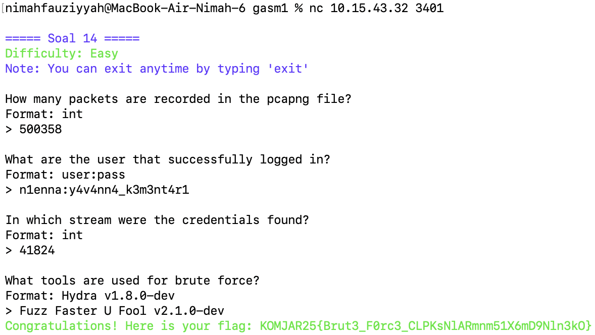

---
## Soal 15
```c
nc 10.15.43.32 3402
```
#### Pertanyaan A
What device does Melkor use?
Format: string
##### Penyelesaian 1
Cari paket GET DESCRIPTOR Response tipe DEVICE. Perhatikan field yang bernama `iManufacturer, iProduct, atau iSerialNumber`. Dan dari situ, terdapat `iProduct: 2`
yang berarti nilai nama produknya berada pada indeks 2 dari **STRING DESCRIPTOR*** yang dikembalikan oleh response GET DESCRIPTOR.
#### Jawaban
```c
Keyboard
```
- Teori
Pada USB, perangkat memberikan device descriptor dan string descriptors. Field seperti `iProduct/iManufacturer` biasanya berisi indeks (nomor) yang menunjuk ke string descriptor yang berisi teks (mis. "Keyboard", vendor, serial). Untuk mengetahui nama perangkat, kita lihat GET DESCRIPTOR (STRING) pada indeks yang diberikan. Ini berguna saat menganalisis capture USB untuk mengenali tipe perangkat.
#### Pertanyaan B
What did Melkor write?
Format: string
##### Penyelesaian 1
Menggunakan display filter berikut di Wireshark:
```c
usb.transfer_type == 0x01
```
Nilai 0x01 tersebut berasal dari deskripsi perangkat (device description). Filter ini membantu menemukan transfer HID (interrupt/input) yang berisi data yang dikirim oleh perangkat.
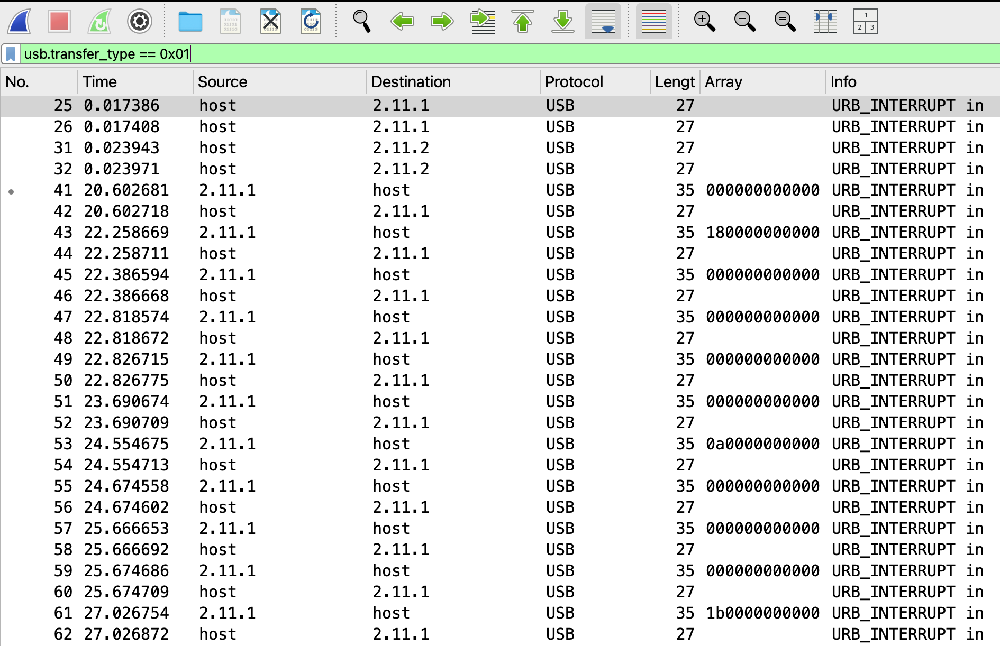
##### Penyelesaian 2
Simpan hasil capture atau paket yang relevan: File > Export Packet Dissections as Plain Text — sehingga payload hex dapat diekstrak untuk diproses lebih lanjut
##### Penyelesaian 3
Jalankan skrip `hiddata.py`, lalu decode hex yang tersimpan. `hiddata.py` adalah skrip Python yang digunakan untuk menerjemahkan array-byte HID menjadi karakter ASCII. Contoh perintah:
```c
python3 hiddata.py hidpaket.txt > decode.txt
```
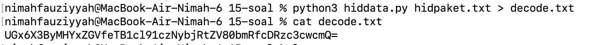
#### Jawaban
```c
UGx6X3ByMHYxZGVfeTB1cl91czNybjRtZV80bmRfcDRzc3cwcmQ=
```
- Teori 
Perangkat HID (mis. keyboard) mengirim data dalam bentuk report (array byte/hex). Untuk membaca teks yang diketik, kita sering perlu mengekspor payload (hex), lalu menjalankan script/dekoder yang mengonversi scancode/hex menjadi karakter ASCII. Filter transfer type membantu memfokuskan pada paket yang berisi report HID (biasanya interrupt transfer untuk keyboard/mouse).

#### Pertanyaan C
What is Melkor's secret message?
Format: string
##### Penyelesaian 1
Dekode (base64) pesan terenkripsi/ter-encode dari jawaban pertanyaan B. Contoh perintah untuk mendekode base64 di terminal:
```c
echo "UGx6X3ByMHYxZGVfeTB1cl91czNybjRtZV80bmRfcDRzc3cwcmQ=" | base64 --decode
```

#### Jawaban
```c
Plz_pr0v1de_y0ur_us3rn4me_4nd_p4ssw0rd
```
- Teori
Base64 sering dipakai untuk meng-encode data teks agar aman dikirim lewat kanal yang berbasis byte/ASCII. Setelah memperoleh string base64 dari hasil decode HID, cukup jalankan base64 decode untuk mendapatkan pesan plaintext. Teknik ini sering ditemui di forensik/analisis jaringan ketika data dikemas untuk dikirim lewat protokol non-tekstual.
### Flag
Jika semua pertanyaan terjawab dengan benar, akan muncul FLAG.
```c
Congratulations! Here is your flag: KOMJAR25{K3yb0ard_W4rr10r_BRxsRQ8etjElDYMOJBbksIR0d}
```
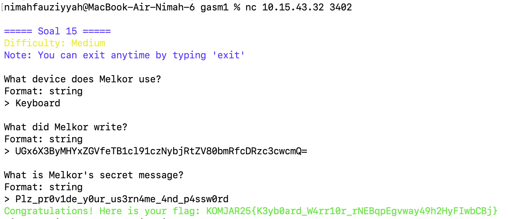

---

## Soal 16
```c
nc 10.15.43.32 3403
```
#### Pertanyaan A
What credential did the attacker use to log in?
Format: user:pass
##### Penyelesaian 1
Gunakan display filter berikut di Wireshark untuk menampilkan perintah FTP USER dan PASS:
```c
ftp.request.command== "USER" || ftp.request.command == "PASS"
```
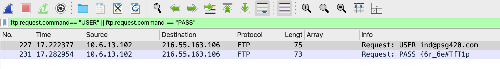
#### Jawaban
```c
ind@psg420.com:{6r_6e#TfT1p
```
- Teori
Perintah FTP USER dan PASS digunakan untuk mengirimkan username dan password ke server. Dengan memfilter keduanya, kita bisa mengekstrak kredensial yang dikirimkan dalam sesi FTP (jika tidak terenkripsi). Ini biasa dipakai dalam forensik jaringan untuk menemukan akun yang digunakan oleh penyerang.
#### Pertanyaan B
How many files are suspected of containing malware?
Format: int
##### Penyelesaian
Klik Follow > TCP Stream untuk melihat keseluruhan percakapan TCP dari sesi FTP tersebut. Dari sana terlihat adanya file bernama q.exe, w.exe, e.exe, r.exe, dan t.exe — yang diduga berisi malware.

#### Jawaban
```c
5
```
- Teori
Dengan mengikuti TCP stream, Wireshark menyatukan semua paket yang membentuk satu koneksi sehingga kita bisa melihat transfer data (mis. daftar file yang dikirim melalui FTP). Ini memudahkan menghitung berapa file yang diunggah/diunduh atau memeriksa isi transfer.
#### Pertanyaan C
What is the hash of the first file (q.exe)?
Format: sha256
##### Penyelesaian 1
Gunakan display filter berikut :
```c
_ws.col.info == "FTP Data: 1274 bytes (PASV) (SIZE q.exe)"
```
Isi dari “Follow -> TCP Stream”, tampilannya seperti ini
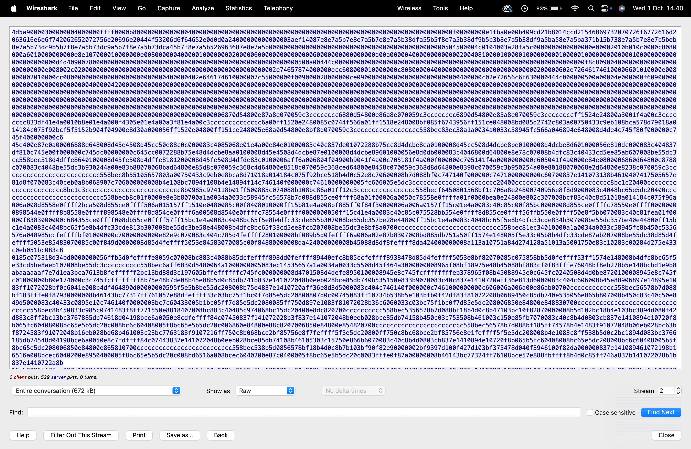
##### Penyelesaian 2
Klik Follow -> TCP Stream -> Save as raw, beri nama file q16
##### Penyelesaian 3
Hitung hash SHA-256 dari file q16 menggunakan command:
```c
sha256sum q16
```
#### Jawaban
```c
ca34b0926cdc3242bbfad1c4a0b42cc2750d90db9a272d92cfb6cb7034d2a3bd
```
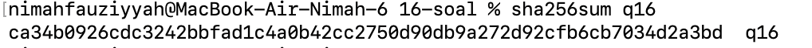

#### Pertanyaan D
What is the hash of the first file (w.exe)?
Format: sha256
##### Penyelesaian 1
Gunakan display filter berikut :
```c
_ws.col.info == "FTP Data: 1274 bytes (PASV) (SIZE w.exe)"
```
Isi dari “Follow -> TCP Stream”, tampilannya seperti ini
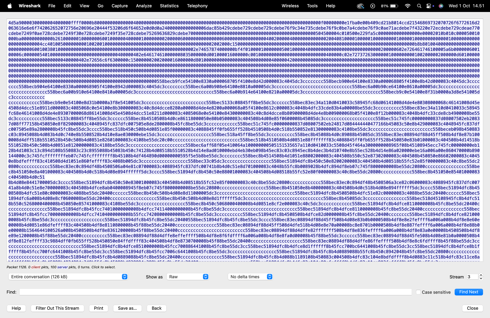
##### Penyelesaian 2
Klik Follow -> TCP Stream -> Save as raw, beri nama file w16
##### Penyelesaian 3
Hitung hash SHA-256 dari file w16 menggunakan command:
```c
sha256sum w16
```
#### Jawaban
```c
08eb941447078ef2c6ad8d91bb2f52256c09657ecd3d5344023edccf7291e9fc
```
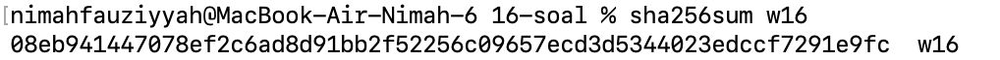

#### Pertanyaan E
What is the hash of the first file (e.exe)?
Format: sha256
##### Penyelesaian 1
Gunakan display filter berikut :
```c
_ws.col.info == "FTP Data: 1274 bytes (PASV) (SIZE e.exe)"
```
Isi dari “Follow -> TCP Stream”, tampilannya seperti ini
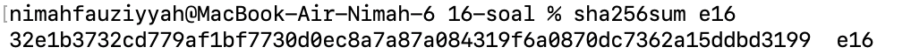
##### Penyelesaian 2
Klik Follow -> TCP Stream -> Save as raw, beri nama file e16
##### Penyelesaian 3
Hitung hash SHA-256 dari file e16 menggunakan command:
```c
sha256sum e16
```
#### Jawaban
```c
32e1b3732cd779af1bf7730d0ec8a7a87a084319f6a0870dc7362a15ddbd3199
```


#### Pertanyaan F
What is the hash of the first file (r.exe)?
Format: sha256
##### Penyelesaian 1
Gunakan display filter berikut :
```c
_ws.col.info == "FTP Data: 1274 bytes (PASV) (SIZE r.exe)"
```
Isi dari “Follow -> TCP Stream”, tampilannya seperti ini
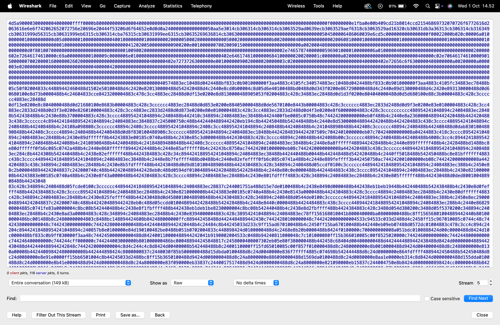
##### Penyelesaian 2
FKlik Follow -> TCP Stream -> Save as raw, beri nama file r16
##### Penyelesaian 3
Hitung hash SHA-256 dari file r16 menggunakan command:
```c
sha256sum r16
```
#### Jawaban
```c
4ebd58007ee933a0a8348aee2922904a7110b7fb6a316b1c7fb2c6677e613884
```
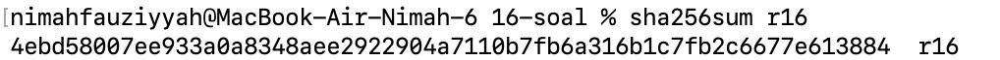

#### Pertanyaan G
What is the hash of the first file (t.exe)?
Format: sha256
##### Penyelesaian 1
Gunakan display filter berikut :
```c
_ws.col.info == "FTP Data: 1274 bytes (PASV) (SIZE t.exe)"
```
Isi dari “Follow -> TCP Stream”, tampilannya seperti ini
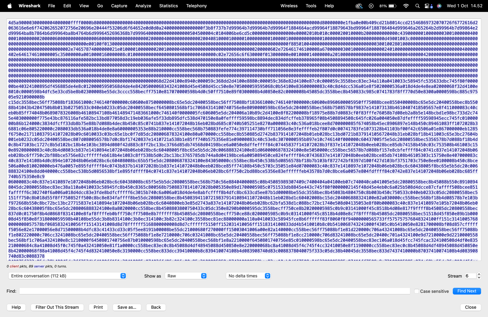
##### Penyelesaian 2
Klik Follow -> TCP Stream -> Save as raw, beri nama file t16
##### Penyelesaian 3
Hitung hash SHA-256 dari file t16 menggunakan command:
```c
sha256sum t16
```
#### Jawaban
```c
10ce4b79180a2ddd924fdc95951d968191af2ee3b7dfc96dd6a5714dbeae613a
```
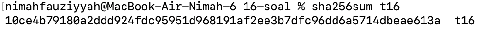

##### Teori Jawaban Pertanyaan C sampai G
- Saat FTP mentransfer file dalam mode aktif atau pasif, isi file muncul sebagai payload pada paket TCP/FTP. Wireshark menampilkan ringkasan di kolom Info (mis. FTP Data: <size> bytes (PASV) (SIZE filename)), sehingga kita dapat langsung menemukan paket yang membawa data file tertentu.
- Follow TCP Stream mengumpulkan semua segmen TCP yang membentuk file tersebut dan memungkinkan kita mengekspor data mentah (raw) tanpa header-protokol — cocok untuk menyimpan ulang sebagai file biner.
- Menghitung SHA-256 pada file mentah memberikan fingerprint kriptografis yang stabil dan dapat digunakan untuk: pemeriksaan integritas, pencarian di layanan reputasi/malware feed, atau bukti di laporan forensik.
- Karena pola langkah (filter → follow stream → save raw → hitung hash) sama untuk tiap file, proses ini dapat diulang (loop) untuk semua file yang ditemukan (q.exe, w.exe, e.exe, r.exe, t.exe).
### Flag
Jika semua pertanyaan terjawab dengan benar, akan muncul FLAG.
```c
Congratulations! Here is your flag: KOMJAR25{Y0u_4r3_4_g00d_4nalyz3r_iDYON1mAHIfDzG2S49awKOBRm}
```
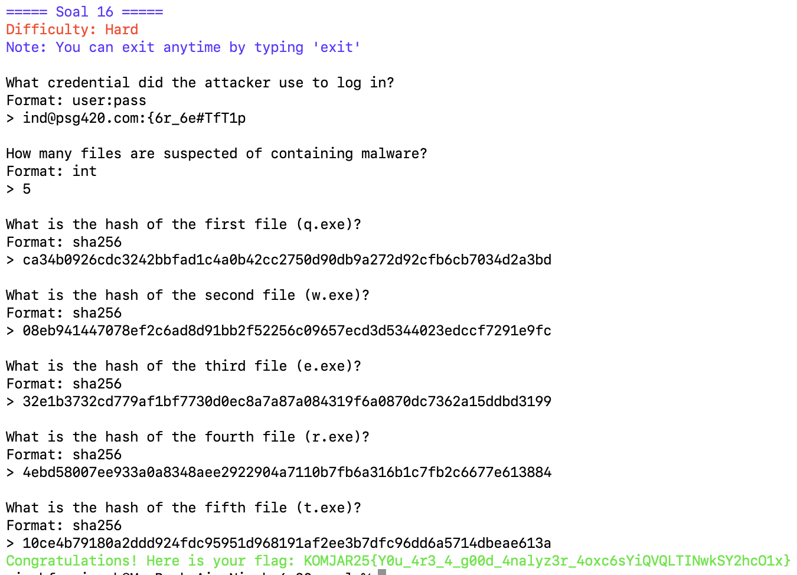

---

## Soal 17
```c
nc 10.15.43.32 3404
```
#### Pertanyaan A
What is the name of the first suspicious file?
Format: file.exe
##### Penyelesaian 1
Pilih File > Export Objects > HTTP di Wireshark.
##### Penyelesaian 2
Kemudian akan muncul daftar objek HTTP yang diekspor — ada 3 file, termasuk `Invoice&MSO-Request.doc`.
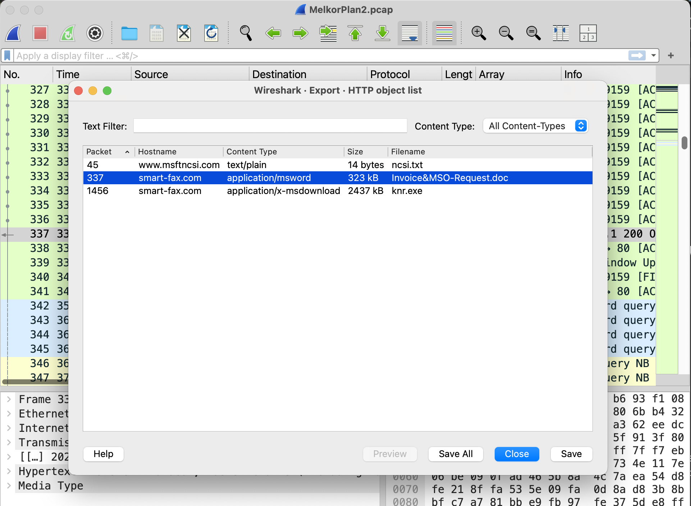
#### Jawaban
```c
Invoice&MSO-Request.doc
```
- Teori
HTTP sering digunakan untuk mengirim/mentransfer file (mis. dokumen, executable) lewat jaringan. Wireshark dapat mengekstrak objek/berkas yang lewat HTTP lewat menu Export Objects > HTTP, sehingga kita dapat menyimpan kembali file-file tersebut untuk analisis statis (mis. scanning antivirus, hashing, atau membuka konten dokumen). Ini berguna untuk menemukan artefak berbahaya yang diunduh lewat web.
#### Pertanyaan B
What is the name of the second suspicious file?
Format: file.exe
##### Penyelesaian 1
Gunakan langkah yang sama seperti pada pertanyaan sebelumnya (File > Export Objects > HTTP). Di sana akan terlihat 3 file termasuk knr.exe.
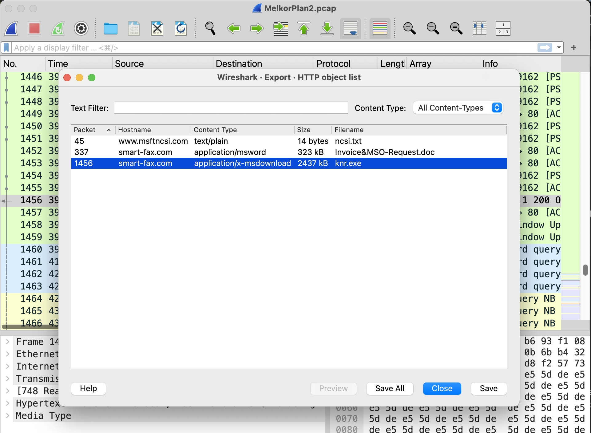
#### Jawaban
```c
knr.exe
```
- Teori
Metode ekstraksi objek HTTP memungkinkan peneliti untuk mengambil file-file biner yang dikirim lewat protokol HTTP. Setelah diekspor, file executable seperti knr.exe bisa dianalisis lebih lanjut — mis. dengan hashing, pemeriksaan string, atau analisis statis/dinamis — untuk menentukan apakah file tersebut berbahaya.

#### Pertanyaan C
What is the hash of the second suspicious file (knr.exe)?
Format: sha256
##### Penyelesaian 1
Pilih File > Export Objects > HTTP → simpan knr.exe.
##### Penyelesaian 2
Hitung hash SHA-256 dari file yang telah disimpan dengan perintah:
```c
sha256sum knr.exe
```
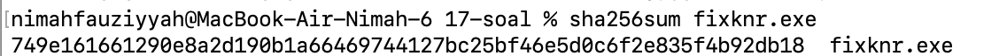
#### Jawaban
```c
749e161661290e8a2d190b1a66469744127bc25bf46e5d0c6f2e835f4b92db18
```
- Teori 
Menghitung SHA-256 menghasilkan fingerprint kriptografis unik untuk sebuah file. Hash digunakan untuk: memastikan integritas file (apakah file sama dengan versi lain), mencocokkan file ke database malware feed/IOC, dan sebagai bukti dalam laporan forensik. Proses umum: ekstrak objek (dari HTTP), simpan sebagai file lokal, lalu jalankan sha256sum atau alat sejenis untuk memperoleh nilai hash.
### Flag
Jika semua pertanyaan terjawab dengan benar, akan muncul FLAG.
```c
Congratulations! Here is your flag: KOMJAR25{M4ster_4n4lyzer_1xcg3WUUjKpux80gm8tEdFgL0}
```
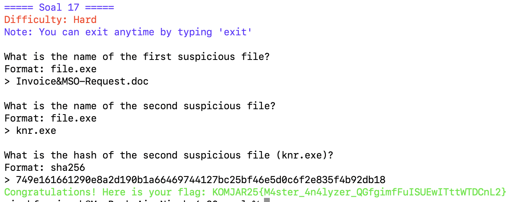

---

## Soal 18
```c
nc 10.15.43.32 3405
```
#### Pertanyaan A
How many files are suspected of containing malware?
Format: int
##### Penyelesaian 1
Pilih File > Export Objects > SMB di Wireshark.
##### Penyelesaian 2
Jika kita melihat file-file yang diekspor, ada 2 file yang namanya dimulai dengan %5cWINDOWS%5c... (yaitu path yang di-URL-encode menuju \WINDOWS\...).
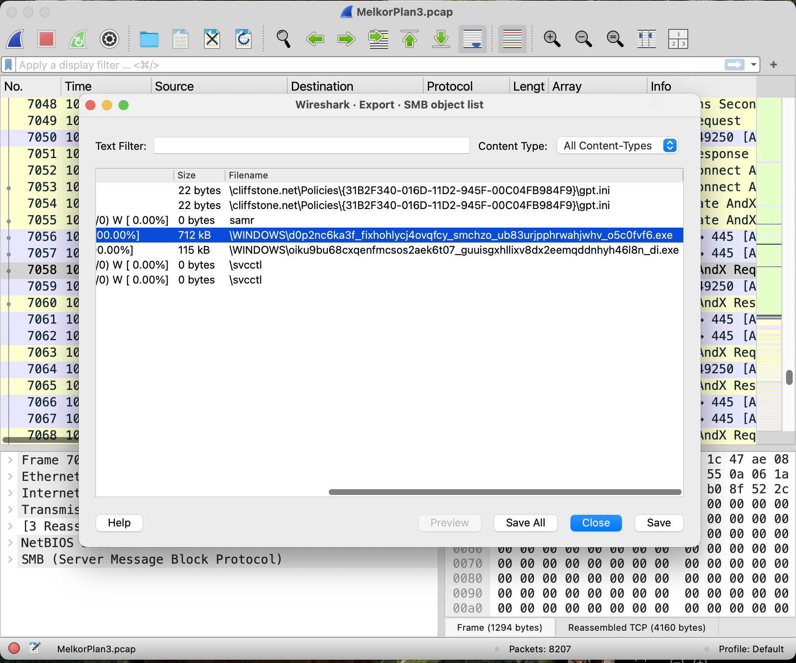
#### Jawaban
```c
2
```
- Teori
SMB (Server Message Block) adalah protokol berbagi file/print yang sering dipakai pada jaringan Windows. Wireshark dapat mengekstrak objek/file yang lewat SMB melalui menu Export Objects > SMB. File yang berisi path seperti %5cWINDOWS%5c... biasanya menunjukkan file yang ditulis atau diambil dari folder Windows pada mesin target — ini patut dicurigai bila muncul dalam konteks serangan/malware. Mengetahui jumlah file berbahaya membantu menilai skala kompromi.
#### Pertanyaan B
What is the name of the first malicious file?
Format: file.exe
##### Penyelesaian 1
Perhatikan kedua file .exe yang ditemukan pada jawaban Pertanyaan A; nama file pertama adalah salah satunya (lihat daftar SMB yang diekspor).
#### Jawaban
```c
d0p2nc6ka3f_fixhohlycj4ovqfcy_smchzo_ub83urjpphrwahjwhv_o5c0fvf6.exe
```
- Teori
Setelah mengekspor objek SMB, periksa nama-nama file yang muncul. File dengan nama acak/panjang dan yang ditempatkan di direktori Windows sering menandakan malware atau dropper yang disamarkan. Mengekspor file memungkinkan analisis lebih lanjut seperti penghitungan hash, scanning antivirus, atau analisis statis/dinamis.
#### Pertanyaan C
Apa nama file berbahaya yang kedua?
Format: file.exe
##### Penyelesaian 1
Lihat kedua file tersebut dan jawaban untuk file kedua dapat ditemukan di sana (nama file kedua tercantum pada daftar SMB yang diekspor).
#### Jawaban
```c
oiku9bu68cxqenfmcsos2aek6t07_guuisgxhllixv8dx2eemqddnhyh46l8n_di.exe
```
#### Pertanyaan D
What is the hash of the first malicious file?
Format: sha256
##### Penyelesaian 1
Hitung hash SHA-256 dari file pertama (yang disimpan/di-ekspor), menggunakan perintah:
```c
sha256sum 18b.exe
```
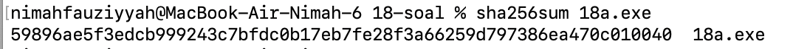
#### Jawaban
```c
59896ae5f3edcb999243c7bfdc0b17eb7fe28f3a66259d797386ea470c010040
```

#### Pertanyaan E
What is the hash of the second malicious file?
Format: sha256
##### Penyelesaian 1
Hitung hash SHA-256 dari file kedua dengan cara yang sama, misal:
```c
sha256sum 18b.exe
```
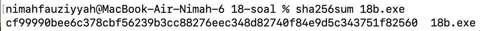
#### Jawaban
```c
cf99990bee6c378cbf56239b3cc88276eec348d82740f84e9d5c343751f82560
```
### Flag
Jika semua pertanyaan terjawab dengan benar, akan muncul FLAG.
```c
Congratulations! Here is your flag: KOMJAR25{Y0u_4re_g0dl1ke_e8XQLgCWiRzzsqZm9XqENF6bY}
```
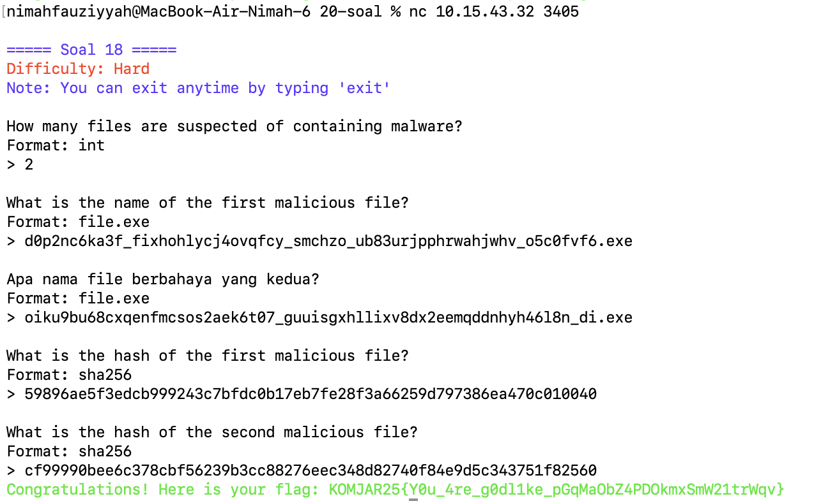

---

## Soal 19
```c
nc 10.15.43.32 3406
```
#### Pertanyaan A
Who sent the threatening message?
Format: string (name)
##### Penyelesaian 1
Lihat protokol SMTP (Simple Mail Transfer Protocol) karena itulah protokol yang digunakan untuk mengirim dan menerima email — lakukan itu dengan mengeklik kolom/label "Protocol" pada Wireshark untuk memfilter paket SMTP.
##### Penyelesaian 2
Gunakan Follow > TCP Stream untuk melihat keseluruhan isi percakapan SMTP (isi email) dalam satu tampilan. Dari sana kita dapat membaca pengirim/isi pesan yang mengancam.
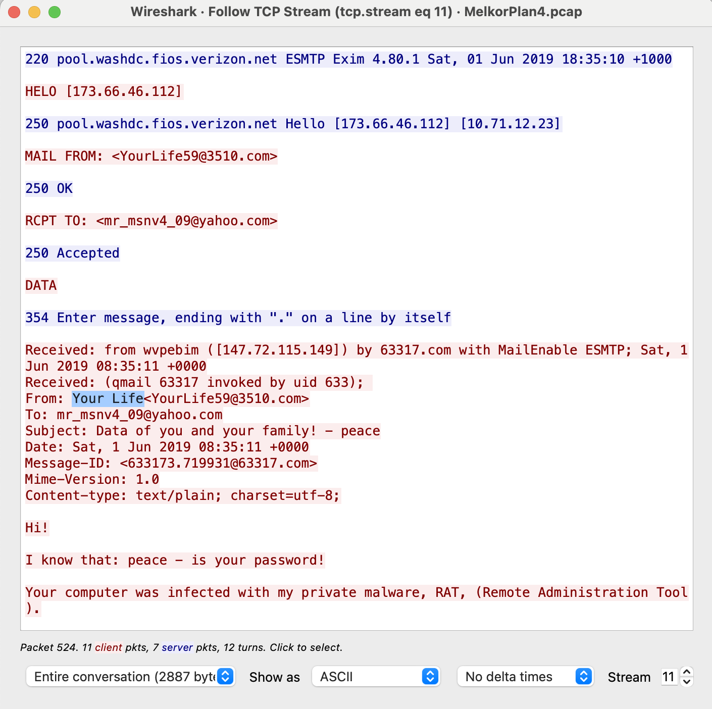
#### Jawaban
```c
Your Life
```
- Teori
SMTP adalah protokol pengiriman email; saat traffic email tidak terenkripsi (atau hanya sebagian), payload (header & body) bisa terlihat jelas di capture.

#### Pertanyaan B
How much ransom did the attacker demand ($)?
Format: int
##### Penyelesaian 1
Dengan cara yang sama seperti pertanyaan sebelumnya (melihat isi email via SMTP dan Follow TCP Stream), kita cukup membaca konten email untuk menemukan jumlah tebusan yang diminta.
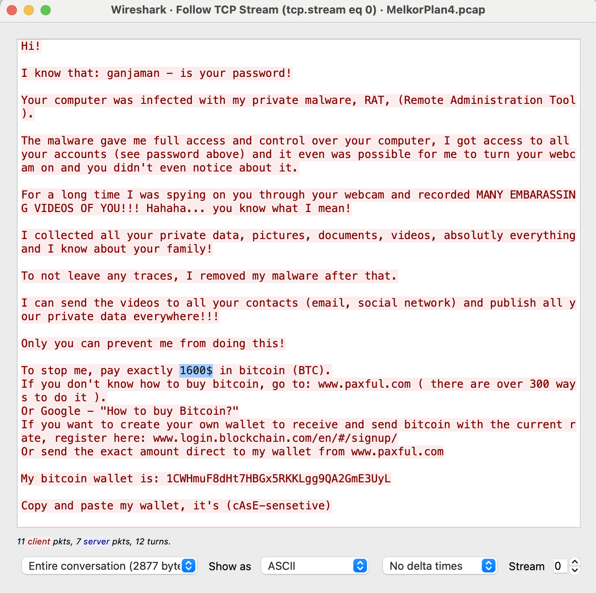
#### Jawaban
```c
1600
```
- Teori
Informasi seperti jumlah tebusan biasanya tercantum secara eksplisit di badan email. Dalam forensik jaringan, mengekstrak body email dari capture membantu menentukan tuntutan, alamat kontak, atau instruksi pembayaran. Jika email terenkripsi (mis. TLS) maka pendekatan lain diperlukan (mis. akses server/endpoint).

#### Pertanyaan C
What is the attacker's bitcoin wallet?
Format: string
##### Penyelesaian 1
Dengan cara yang sama seperti sebelumnya — baca isi email melalui hasil Follow TCP Stream — kita dapat menemukan alamat dompet Bitcoin pelaku yang biasanya ditulis langsung di pesan.
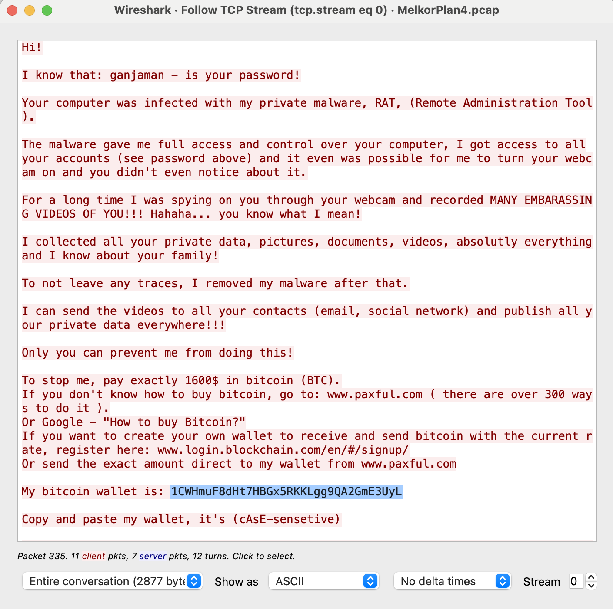
#### Jawaban
```c
1CWHmuF8dHt7HBGx5RKKLgg9QA2GmE3UyL
```
### Flag
Jika semua pertanyaan terjawab dengan benar, akan muncul FLAG.
```c
Congratulations! Here is your flag: KOMJAR25{Y0u_4re_J4rk0m_G0d_uYgq9qyc7cdrJ2F5gyBt0otqK}
```
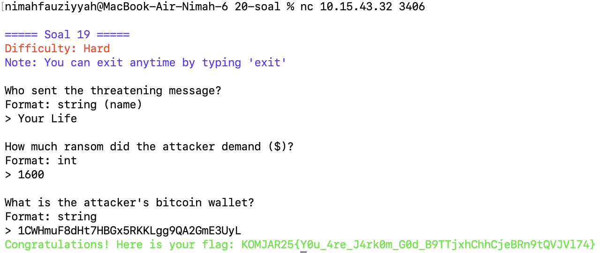

---

## Soal 20
```c
nc 10.15.43.32 3407
```
#### Pertanyaan A
What encryption method is used?
Format: string
##### Penyelesaian 1
Identifikasi protokol dulu; menggunakan TLS.
##### Penyelesaian 2
Gunakan display filter berikut di Wireshark:
```c
tls.handshake.type == 2
```
Filter ini mencari Server Hello (handshake type 2), yaitu paket saat server memilih versi TLS dan satu-satunya cipher suite yang dipakai untuk sesi, dan juga mengembalikan informasi selected key_share.
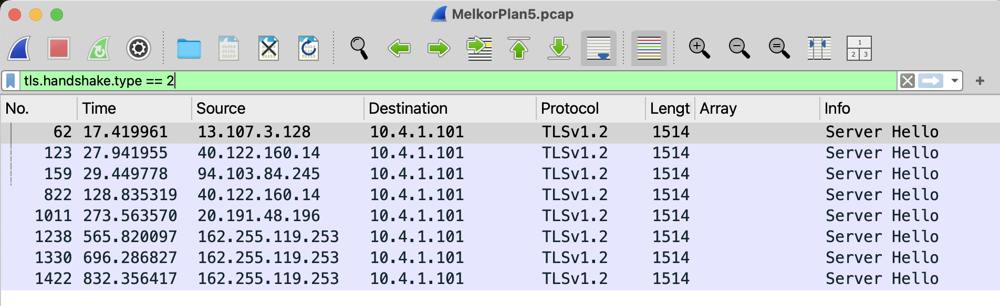
#### Jawaban
```c
TLS
```
- Teori 
TLS (Transport Layer Security) adalah protokol kriptografi yang melindungi komunikasi jaringan (pengganti SSL). Pada fase handshake, klien dan server menyepakati versi TLS, cipher suite, dan mekanisme pertukaran kunci (key exchange). `tls.handshake.type == 2` merujuk ke Server Hello — paket penting karena mengungkap pilihan protokol/cipher server. Jika capture memiliki keylog (pre-master secrets), Wireshark bisa mendekripsi lalu lintas TLS untuk melihat payload (jika disiapkan).

#### Pertanyaan B
What is the name of the malicious file placed by the attacker?
Format: file.exe
##### Penyelesaian 1
Dari folder yang disediakan oleh asisten, kita juga mendapatkan keylogs.txt. Buka Wireshark → Preferences → Protocols → TLS → klik Browse dan masukkan keylogs.txt. (Ini memungkinkan Wireshark menggunakan keylog untuk mendekripsi sesi TLS yang terekam.)
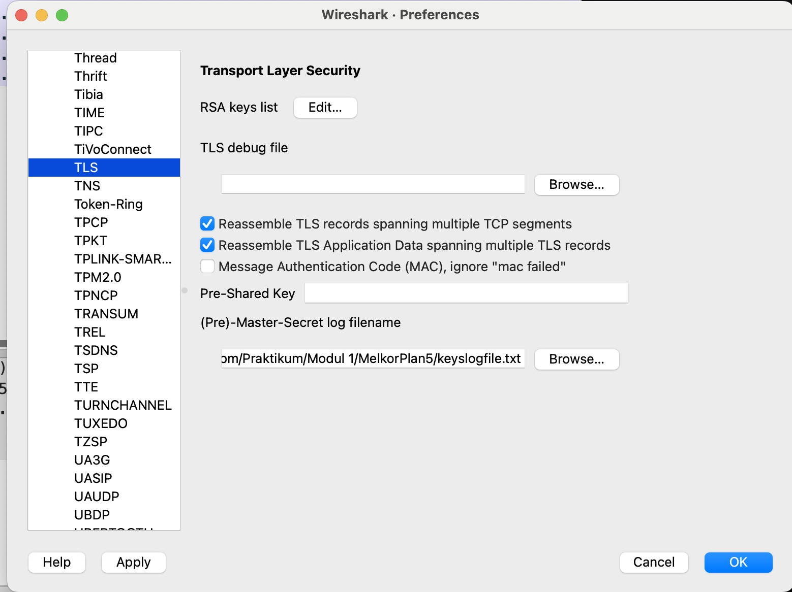
##### Penyelesaian 2
gunakan display filter:
```c
http.response.code == 200
```
untuk mencari respons HTTP yang sukses. Gunakan Follow > TCP Stream pada aliran yang relevan; dari sana terlihat bahwa pada hasil HTTP GET terdapat file bernama `invest_20.dll.`
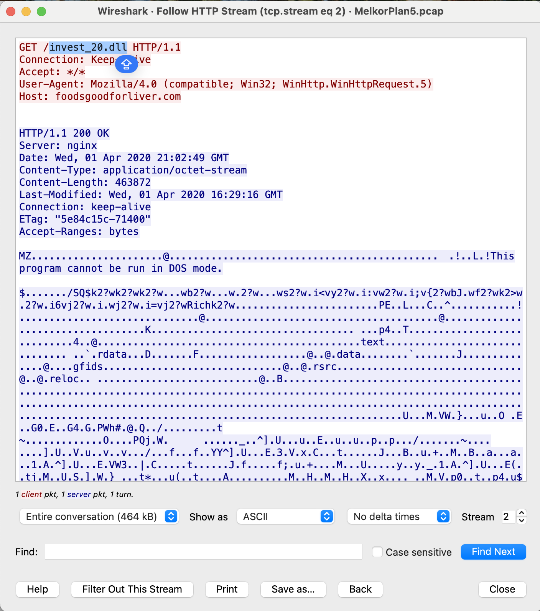
#### Jawaban
```c
invest_20.dll
```
- Teori
1. Keylog (keylogs.txt): file ini (biasanya berformat NSS/SSLKEYLOGFILE) berisi kunci yang memungkinkan Wireshark mendekripsi sesi TLS pada capture—sangat membantu untuk melihat konten yang seharusnya terenkripsi.
2. Setelah dekripsi aktif, gunakan filter HTTP (mis. `http.response.code == 200`) untuk menemukan transfer file yang sukses. Follow TCP Stream menyatukan percakapan sehingga kita dapat melihat isi HTTP (header & body) dan menemukan nama file yang diunduh (`invest_20.dll`).

#### Pertanyaan C
What is the hash of the file containing the malware?
Format: sha256
##### Penyelesaian 1
Setelah file disimpan (dari langkah pada pertanyaan sebelumnya), hitung SHA-256 dari file tersebut dengan perintah:
```c
sha256sum invest_20.dll
```
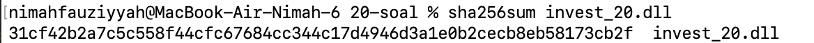
#### Jawaban
```c
31cf42b2a7c5c558f44cfc67684cc344c17d4946d3a1e0b2cecb8eb58173cb2f
```
### Flag
Jika semua pertanyaan terjawab dengan benar, akan muncul FLAG.
```c
Congratulations! Here is your flag: KOMJAR25{B3ware_0f_M4lw4re_Q1lBjLY0oJ3rCllqfcUS8GO4a}
```
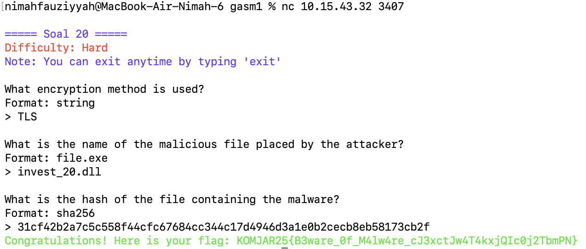
